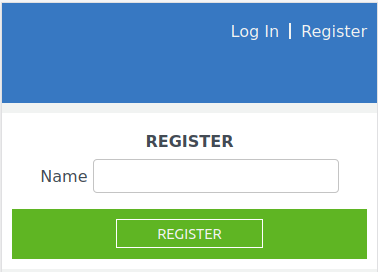

# Teachers Clockify Website  [Live Link](https://teacher-clockify.herokuapp.com/session/new)

A Mobile version website where teahcers log in their working hours. 

## User Login Page

## Register User Page

## User Home Page

## Shows the most recent entry for teaching hours along with the grades taught

## Form for entering teaching hours

## Shows the entries made for hours spent planning/checking with the most recent entry at the top

## Form for entering planning/checking hours

## Shows the Grade Levels created by the signed-in user

## Form for entering new Grade level

## Shows the teaching hours spent on a particular grade

## Built With


- Ruby on Rails
- VS Code
- postgres
- Rubocop
- Gems (font-awesome, rspec rails, capybara, databse cleaner)

## Getting Started
## Getting Started on local repo

To get a local copy up and running follow these simple example steps.

### Install
In order to run, you need to install RUBY and Rails in your computer. For windows you can go to [Ruby installer](https://rubyinstaller.org/) and for MAC and LINUX you can go to [Ruby official site](https://www.ruby-lang.org/en/downloads/) for intructions on how to intall it.

Clone this project by typing ```git clone git@github.com:saimaAnis21/Teachers_Clockify.git```

### Run app
- Type ```bundle install``` in the root file of the project.
- Install yarn by typing ```gem install yarn``` or simply run ```npm install --global yarn```
- Check if the yarn has been installed by running ```yarn --version```
- Type  ```rails db:migrate``` in the root file of the project. 
- Type ```rails s``` in the root file of the project.
- Goto [local host](http://localhost:3000/)
- You can go to rails console by typing ```rails console``` and create a user by using Active Record commands and methods.
- While in the rails console, use Hirb.enable to run your SQL queries and view the returned data in tabular format.
### How to run the test suite
- Type ```rspec``` in the root file of the project.

## Author

👤 **Saima**

- GitHub: [@saimaAnis21](https://github.com/saimaAnis21)
- Twitter: [@SheTALKS](https://twitter.com/SheTALKS6)
- LinkedIn: [Saima Anis](https://www.linkedin.com/in/saima-anis-3a07921b2/)


## 🤝 Contributing

Contributions, issues, and feature requests are welcome!


## Show your support

Give a ⭐️ if you like this project!

## 📝 License

Copyright 2020 Saima Anis

Permission is hereby granted, free of charge, to any person obtaining a copy of this software and associated documentation files (the "Software"), to deal in the Software without restriction, including without limitation the rights to use, copy, modify, merge, publish, distribute, sublicense, and/or sell copies of the Software, and to permit persons to whom the Software is furnished to do so, subject to the following conditions:

The above copyright notice and this permission notice shall be included in all copies or substantial portions of the Software.

THE SOFTWARE IS PROVIDED "AS IS", WITHOUT WARRANTY OF ANY KIND, EXPRESS OR IMPLIED, INCLUDING BUT NOT LIMITED TO THE WARRANTIES OF MERCHANTABILITY, FITNESS FOR A PARTICULAR PURPOSE AND NONINFRINGEMENT. IN NO EVENT SHALL THE AUTHORS OR COPYRIGHT HOLDERS BE LIABLE FOR ANY CLAIM, DAMAGES OR OTHER LIABILITY, WHETHER IN AN ACTION OF CONTRACT, TORT OR OTHERWISE, ARISING FROM, OUT OF OR IN CONNECTION WITH THE SOFTWARE OR THE USE OR OTHER DEALINGS IN THE SOFTWARE.
